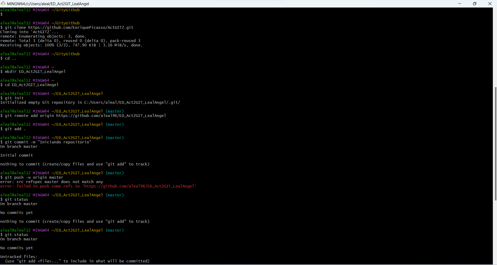
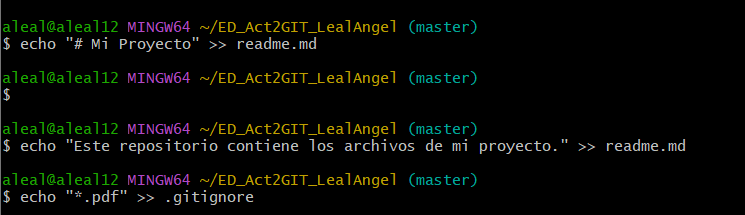
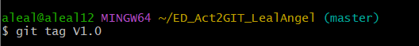
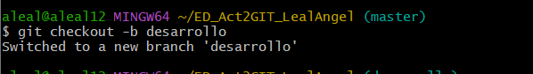
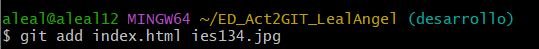
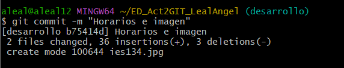
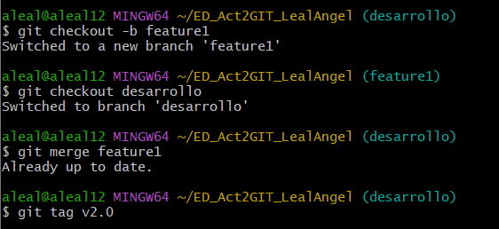
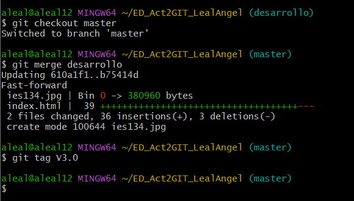

### Git y Github.

1. Clonar el repositorio ActGIT2.git en mi equipo:
``git clone https://github.com/EnriquePicasso/ActGIT2.git``

Crear un nuevo repositorio local llamado ED_Act2GIT_LealAngel:
``mkdir ED_Act2GIT_Tunombre``
``cd ED_Act2GIT_Tunombre``
``g``it init``
Añadir el repositorio local a GitHub:
Crear un nuevo repositorio en GitHub 
Configurar el repositorio remoto:
``git remote add origin URL_DEL_REPOSITORIO_EN_GITHUB``
Ahora guardamos el archivo html en el repositorio local y lo añadimos al stage, luego hacemos commit y push al repositorio remoto.

``git status``
``git add index.html``
``git commit -m ""``
``git push origin master``

Ahora creamos dentro del repositorio el documento README.md y .gitignore, los añadimos al stage y hacemos commit.

Etiquetamos como V1.0.

Y ahora creamos una rama llamada "desarrollo"

Editamos el documento index y añadimos horarios. Tras editarlo.
Añadimos al stage la imagen del centro y la pagina.

Hacemos commit 

Ahora crearemos otra rama desde la rama desarrollo llamada feature1.

