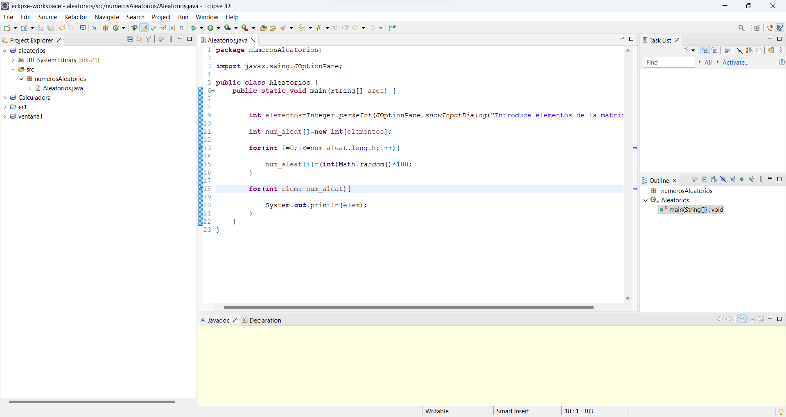
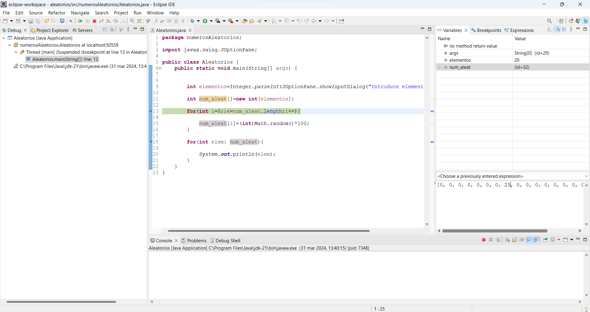
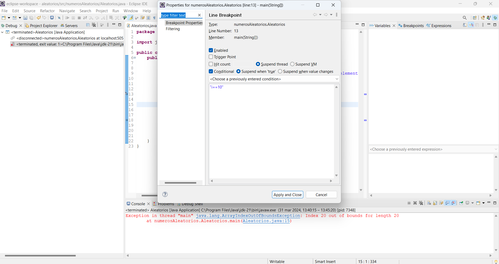
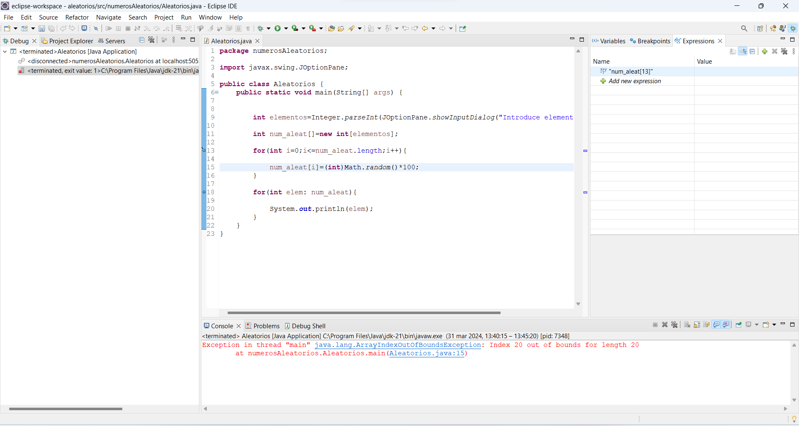

## Depurando numeros aleatorios
Creamos un proyecto en Eclipse en el que añadimos el archivo .java
Abrimos el documento .java de nuestro proyecto en el explorador de proyectos.
Ahora añadimos puntos de ruptura en el documento, añadiremos un punto de ruptura en cada bucle for.

Ahora pulsamos sobre el documento .java con el boton derecho y buscamos la opcion debug as > java application.
Modificamos el valor de la posición 8 del Array en la pestaña variables.

Para generar un breakpoint condicional debemos hacer click derecho sobre el breakpoint que queramos modificar y nos vamos al apartado breakpoint properties, y añadimos la condición, que será ``i==10``

Añadimos la expresión para comprobar el valor de la posición 14 del array.

Para corregir el código del documento debemos cambiar algunas lineas y queda de la siguiente forma:
package numerosAleatorios;

import javax.swing.JOptionPane; 

public class Aleatorios {
    public static void main(String[] args) {
        int elementos = Integer.parseInt(JOptionPane.showInputDialog("Introduce elementos de la matriz")); 
        int num_aleat[] = new int[elementos];
        
        for (int i = 0; i < num_aleat.length; i++) {
            num_aleat[i] = (int)(Math.random() * 100);
        }
        
        for (int elem : num_aleat) {
            System.out.println(elem);
        }
    }
}
En el primer bucle for, corregí el error en la condición, que debe ser i < num_aleat.length en lugar de i <= num_aleat.length. Esto evita un ArrayIndexOutOfBoundsException.
En el cálculo de números aleatorios, corregí la precedencia de operadores colocando (int) alrededor de (Math.random() * 100) para asegurar que el resultado sea convertido a int correctamente.