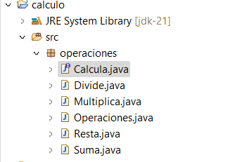
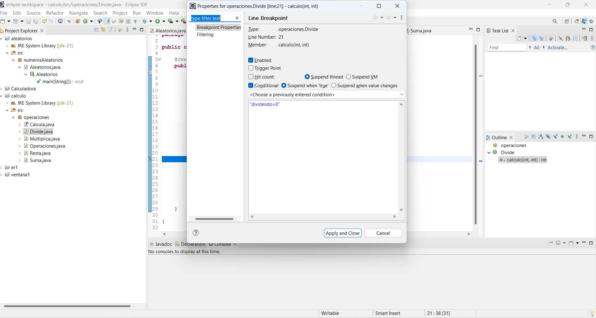

Para esta tarea debemos crear un proyecto java e introducir todos los documentos .java en él.

Proceso de Depuración:
Puntos de Ruptura (Breakpoints):
Los puntos de ruptura se utilizan para detener la ejecución del programa en una línea específica de código.
Estableceremos puntos de ruptura en lugares estratégicos donde sospechamos que pueden ocurrir errores.

Step Into : Nos permite ingresar a un método o función en la línea actual del código.
Step Over: Ejecuta la línea actual del código y avanza a la siguiente línea sin ingresar a métodos o funciones.
Step Return: Nos permite salir del método actual y volver al método que lo llamó.
Punto de Ruptura Condicional:
Se utiliza para detener la ejecución del programa solo cuando se cumple una condición específica.
Ponemos un punto de ruptura condicional en la clase Divide.java para detener la ejecución cuando el dividendo sea igual a 0.

Los errores que he podido encontrar y solucionar los siguientes:
1. Divide.java:
Error: El bucle while dentro del método calculo() no está implementado correctamente para calcular la división mediante restas sucesivas. La variable dividendo debería disminuir en divisor en lugar de incrementarse.
Solución: Cambiar dividendo = dividendo - divisor; en lugar de dividendo = divisor - dividendo;.
2. Multiplica.java:
Error: En el método calculo(), el bucle for no está multiplicando adecuadamente los valores num1 y num2. En cada iteración del bucle, acum se actualiza sumando num2, pero debería multiplicarse correctamente.
Solución: Cambiar acum = acum + num2; en el bucle for por acum = acum + num1;.

