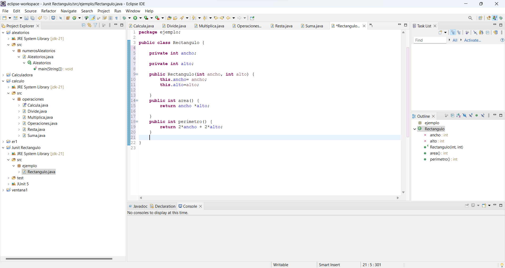
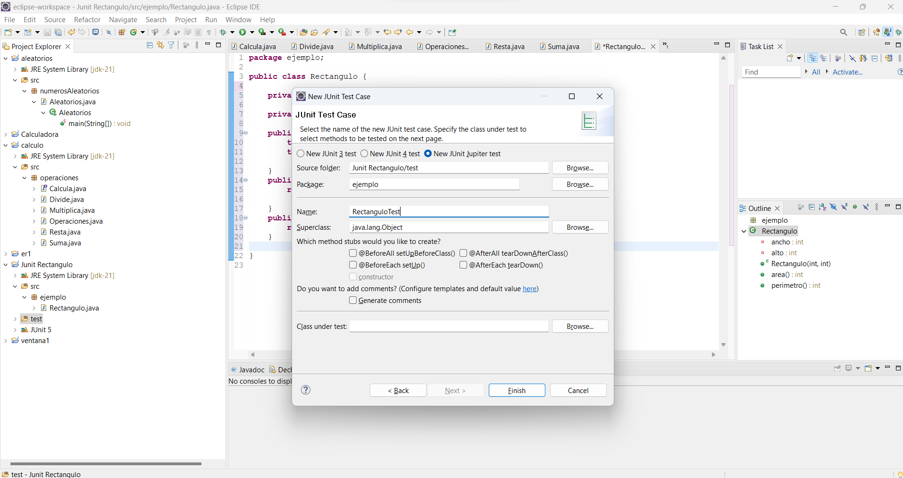
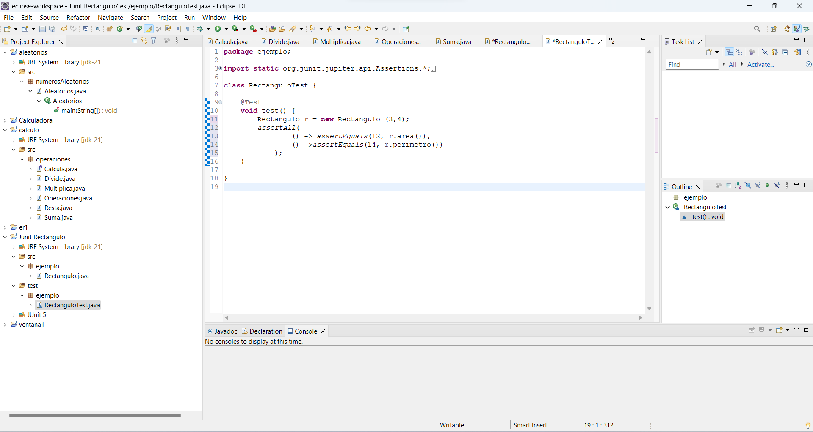

Creamos el proyecto y agregamos JUNIT dentro de las librerias para poder trabajar con él.

Creamos una nueva carpeta que llamamos test, para tener los test apartados del código.
Ahora creamos la clase rectangulo dentro del paquete ejemplo y la rellenamos:

Ahora creamos un test case dentro de la carpeta test.

y lo ejecutamos como test de Junit.

