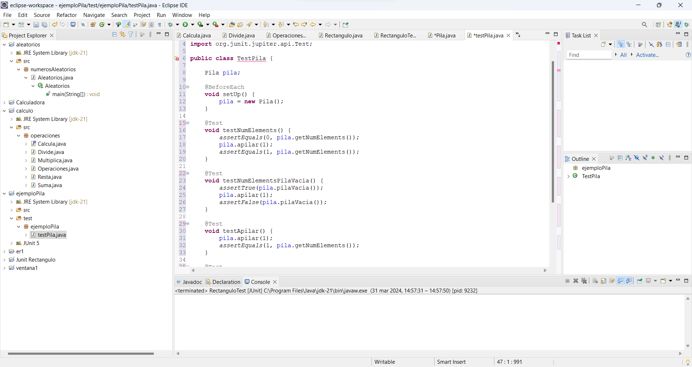
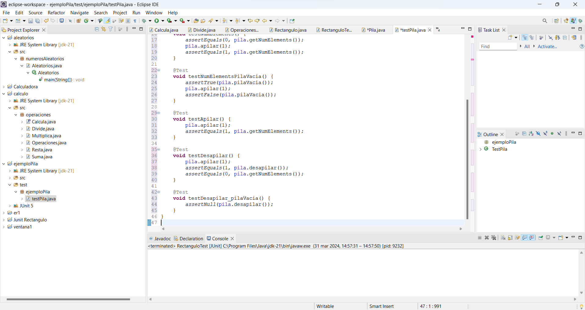

### Test creados para la clase pila.

### Respuestas a las preguntas:

1. **¿Para qué sirve en JUnit? ¿Y qué parámetros tiene?**
   - **@AfterEach:** Esta anotación se utiliza en JUnit para especificar un método que debe ejecutarse después de cada método de prueba en una clase de prueba. Es útil para limpiar o restablecer el estado después de cada prueba.
   - **@AfterAll:** Esta anotación se utiliza para especificar un método que debe ejecutarse después de que se hayan ejecutado todos los métodos de prueba en una clase de prueba. Se usa para realizar tareas de limpieza una vez que se hayan completado todas las pruebas.
   - **@BeforeEach:** Se utiliza para indicar un método que se ejecutará antes de cada método de prueba en una clase de prueba. Es útil para inicializar el estado antes de cada prueba.
   - **@BeforeAll:** Se utiliza para especificar un método que debe ejecutarse antes de que se ejecuten todos los métodos de prueba en una clase de prueba. Se utiliza para realizar configuraciones que son comunes a todas las pruebas en la clase.
   - **assertAll():** Este método se utiliza para agrupar múltiples afirmaciones en una sola llamada. Si alguna de las afirmaciones falla, se mostrarán todas las fallas al mismo tiempo.
