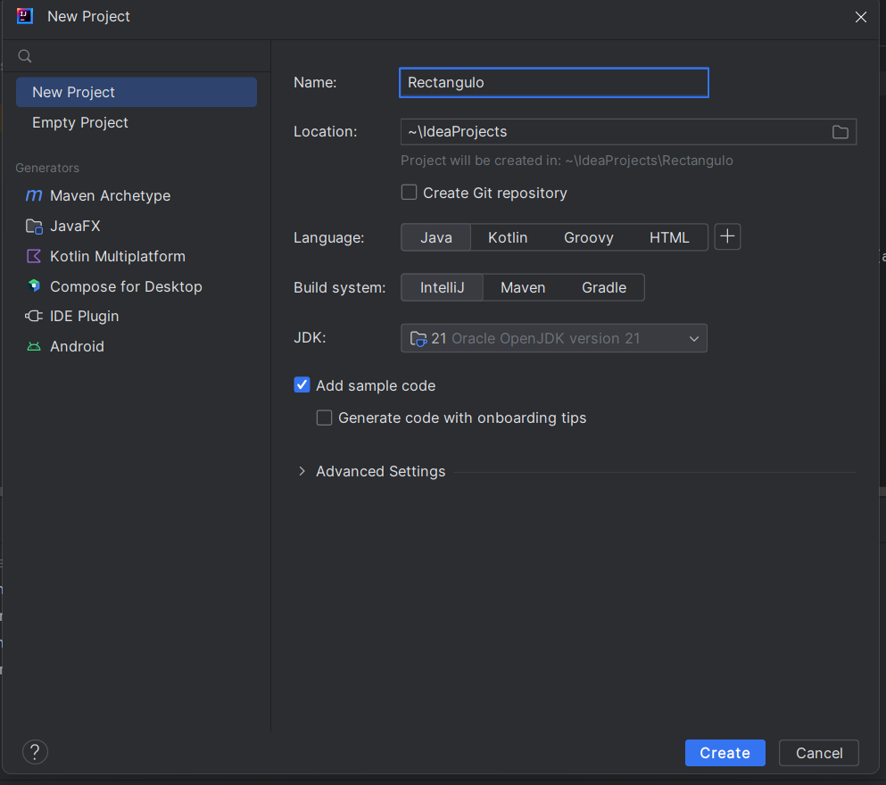
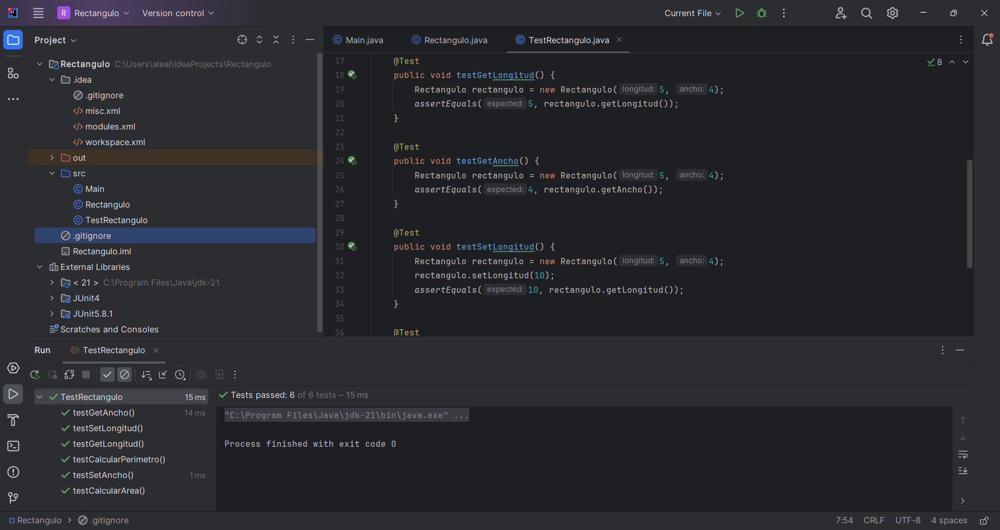

Creamos un proyecto java en IntelliJ que será el IDE con el que llevaremos a cabo la tarea.

Tras importar los archivos de Junit a IntelliJ escribimos el codigo para realizar el test y lo ejecutamos.

Adjunto codigo del test: 
package ejemploPila;
import static org.junit.jupiter.api.Assertions.*;
import org.junit.jupiter.api.BeforeEach;
import org.junit.jupiter.api.Test;

public class TestPila {

    Pila pila;

    @BeforeEach
    void setUp() {
        pila = new Pila();
    }

    @Test
    void testNumElements() {
        assertEquals(0, pila.getNumElements());
        pila.apilar(1);
        assertEquals(1, pila.getNumElements());
    }

    @Test
    void testNumElementsPilaVacia() {
        assertTrue(pila.pilaVacia());
        pila.apilar(1);
        assertFalse(pila.pilaVacia());
    }

    @Test
    void testApilar() {
        pila.apilar(1);
        assertEquals(1, pila.getNumElements());
    }

    @Test
    void testDesapilar() {
        pila.apilar(1);
        assertEquals(1, pila.desapilar());
        assertEquals(0, pila.getNumElements());
    }

    @Test
    void testDesapilar_pilaVacia() {
        assertNull(pila.desapilar());
    }
}
